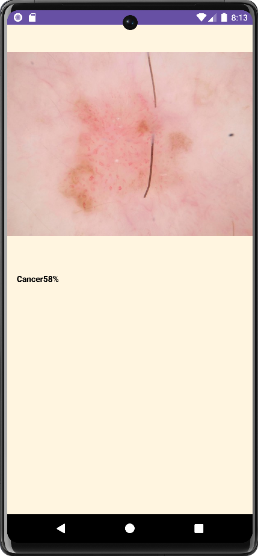

# Asclepius
Asclepius is an Android app that utilize machine learning to detect skin cancer. Users can upload photos of skin lesions or moles, and the app evaluates them to determine the risk of cancer.
## Features
### TensorFlow Lite for On-Device Image Classification
Uses TensorFlow Lite for on-device image classification, providing fast and secure image analysis without the need for cloud services. This allows users to receive immediate results without needing an internet connection.
### Crop and Rotate Image with uCrop
Added crop and rotate features of images using uCrop library before get processed by machine learning, so that the prediction results that will be processed get maximum results.
## Screenshots

  
  
  
  
    
  
  
  

